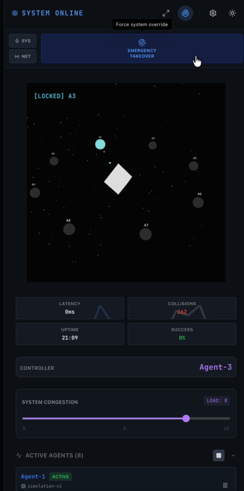

# ATC (AI Traffic Control) System

The **ATC System** is a distributed AI agent management platform designed to visualize and control concurrent agent activities in real-time. It simulates a high-stakes "Air Traffic Control" environment where AI agents compete for resources (locks) to perform tasks, while a human administrator retains ultimate override authority.

## 🚀 Key Features

### 📡 Real-time Visualization
- **3D Radar Interface:** Interactive 3D visualization using **React Three Fiber** showing agent positions, lock status, and activity.
- **Visual Feedback:** Dynamic color coding for Agent states (Idle, Active, Locked, Human Override) and particle effects for data transmission.
- **Detachable View:** Radar can be detached to a full-screen "Main View" for immersive monitoring.

| Ultra-Compact Monitoring | Preview |
| :--- | :--- |
| **Seamless Layout Adaptation:** The main viewport is engineered to collapse completely to 0px width without breaking layout integrity. This allows administrators to shrink the browser window to focus solely on the **Sidebar Control Panel**—perfect for keeping an eye on system metrics and emergency controls while multitasking on a single screen. <br><br> **Dynamic UI Orchestration:** Floating elements like `TerminalLog` and `AgentTacticalPanel` automatically adjust their positioning based on the real-time `sidebarWidth`. This prevents visual overlap and ensures critical controls remain accessible even in the most compact configurations. |  |

### 🎮 Human-in-the-Loop Control
- **Emergency Takeover:** Instant administrative lock override (`RELEASE LOCK` / `EMERGENCY TAKEOVER`) to prevent collisions or halt rogue agents.
- **Traffic Intensity Control:** Adjustable system congestion (agent pool size) via a dedicated slider.
- **Tactical Panel:** Drag-and-drop interface to manage, rename, pause, or terminate specific agents.

### 🔐 Distributed Coordination
- **Hazelcast Locking:** Implements distributed locking primitives (Fencing Tokens) to ensure mutual exclusion between agents.
- **Race Condition Handling:** robust logic to handle lock acquisition latency and immediate human preemption.

### 🛠 Modern UI/UX
- **Responsive Design:** Fully responsive layout with a collapsible sidebar and flexible main content area.
- **Themes:** Toggle between **Cyberpunk Dark Mode** (Deep Space) and **Clean Light Mode** (Corporate).
- **SoundFX:** Audio feedback for system events (Lock Acquired, Alarm, Override), with granular mute controls (SYS/NET).

## 🏗 Architecture

The project is structured as a monorepo:

### `packages/backend` (Node.js + Express)
- **Core Service (`atc.service.js`):** Manages the simulation loop, agent lifecycle, and global state.
- **Agent Simulation (`Agent.js`):** Independent agent instances that autonomously loop, request locks, and simulate LLM tasks.
- **Locking (`HazelcastManager.js`):** Interacts with Hazelcast Cloud for distributed CP (Consistency/Partition Tolerance) locking.
- **API:** REST endpoints for control and SSE (Server-Sent Events) for real-time state streaming.

### `packages/frontend` (React + Vite + Tailwind)
- **State Management:** Custom `useATC` hook handling SSE streams and optimistic UI updates.
- **Components:**
  - `Sidebar`: Main control center.
  - `Radar`: 3D visualization.
  - `TerminalLog`: Real-time system log with filter capabilities.
  - `AgentTacticalPanel`: Floating window for specific agent operations.

## 📦 Installation & Setup

### Prerequisites
- Node.js (v18+)
- Hazelcast Cloud Cluster (or local instance)

### 1. Backend Setup
```bash
cd packages/backend
npm install
# Configure .env and certs/ for Hazelcast (see .env.example)
node index.js
```

### 2. Frontend Setup
```bash
cd packages/frontend
npm install
npm run dev
```

## 🛡️ Security & Scalability
- **Hard Limits:** Agent scaling is capped at 10 to prevent resource exhaustion in this demo environment.
- **Override Priority:** Human commands always preempt AI locks via Fencing Tokens.

## 📝 License
ISC
