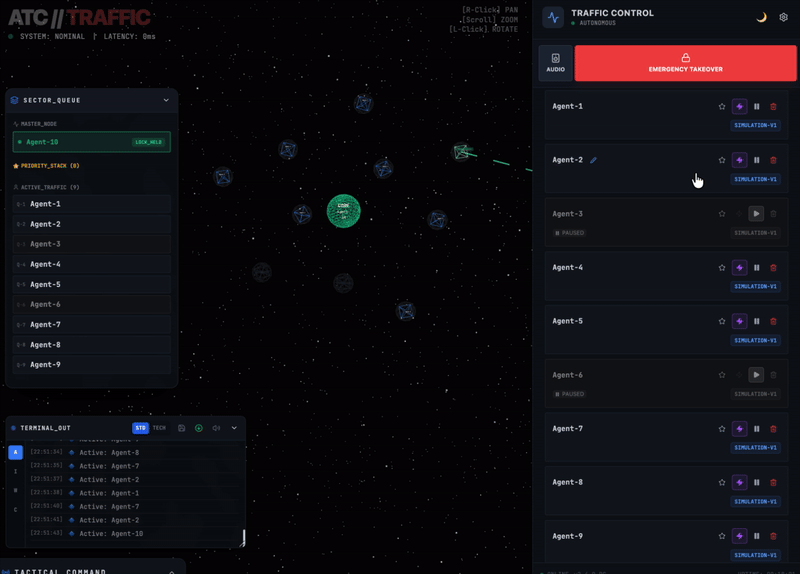
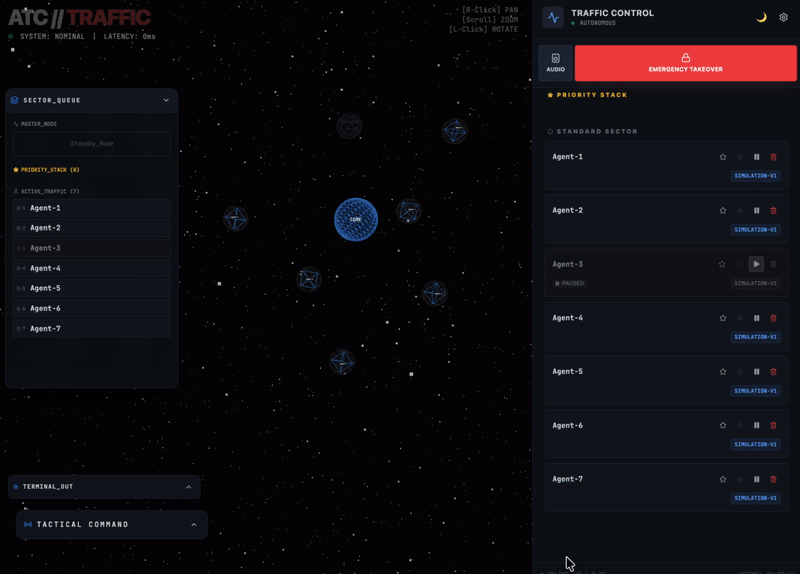
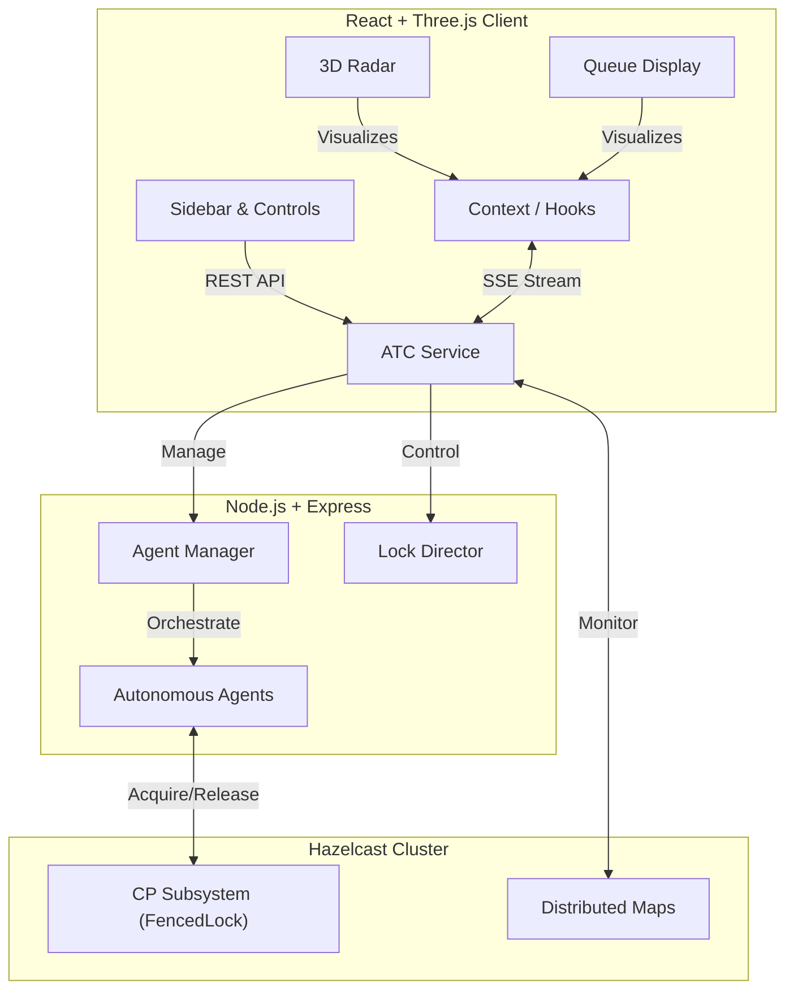

# Agent Traffic Control (ATC) System


**Agent Traffic Control (ATC)** is a high-performance, distributed visualization system designed to monitor and manage autonomous agent resource contention in real-time. Built with a **Cyberpunk-inspired UI**, it provides "God-mode" controls to oversee locking mechanisms, priority queues, and emergency overrides across a distributed Hazelcast cluster.

---

## 🚀 Key Features

### 1. 3D Tactical Radar (Three.js / R3F)
- **Real-time Visualization**: Agents are rendered as autonomous drones orbiting a central resource hub.
- **Smart Camera System**: Auto-tracking with smooth interpolation (`lerp`) and seamless user interruption handling (OrbitControls sync).
- **Visual Feedback**:
    - **Green Beam**: Active Lock Holder (Processing).
    - **Purple Pulse**: Force Seize / Hostile Takeover in progress.
    - **Red Pulse**: Paused / Suspended agents.

### 2. Distributed Locking & Concurrency
- **Hazelcast CP Subsystem**: Guarantees strong consistency for distributed locks using the `FencedLock` mechanism.
- **Priority Queueing**: Dynamic scheduling where VIP agents (Star badge) bypass standard waiting lists in the traffic flow.
- **Force Transfer (Seize)**: Administrative capability to forcibly rip the lock from the current holder and assign it to a target candidate.

### 3. Live System Monitoring
- **Sector Queue Panel**: Draggable HUD showing the live state of the **"Priority Stack"** vs **"Standard Queue"**.
- **Terminal Logs**: Real-time event streaming via SSE (Server-Sent Events) with **Virtual Scrolling** for high-performance rendering of high-frequency logs.
- **Audio Engine**: Custom `MasterGain` architecture providing immersive tactical sound feedback while respecting browser interaction policies.

### 4. Administrative "God-Mode"
- **Emergency Override**: Instantly suspends all autonomous agents and grants the lock to the "Human-Operator" for manual intervention.
- **Global Stop**: One-click system freeze to halt all distributed operations for immediate safety or debugging.
- **Traffic Intensity**: Dynamic scaling of agent pool size via real-time slider controls.

---

## 🎬 Demo Scenarios

### Scenario 1: The Hostile Takeover (Force Seize)
> **Objective**: Forcefully transfer control from a deadlock or an underperforming agent to a target candidate.

1.  **Identify**: Locate the current Lock Holder (Green) in the **Radar** or **Queue Display**.
2.  **Select**: Click any waiting agent (e.g., `agent-02`) to open the Tactical Menu.
3.  **Execute**: Click the **SEIZE (Purple Zap)** button.
4.  **Observe**: The target agent pulses **Purple** and captures the lock, while logs report: `📡 [CMD] SEIZE TARGET -> agent-02`.

### Scenario 2: VIP Fast-Track (Priority Injection)
> **Objective**: Grant VIP status to an agent to bypass the standard rotation.

1.  **Grant**: Click the **Star (VIP)** icon on an agent in the **Standard Sector**.
2.  **Result**: The agent immediately jumps to the **"Priority Stack"**. It bypasses all standard agents for the next available lock acquisition cycle.

### Scenario 3: Autonomous Tracking (Tactical Focus)
> **Objective**: Track a specific agent in the 3D space and seamlessly switch to manual control.

1. **Target**: Click any drone in the **Radar** view.
2. **Track**: The camera smoothly zooms in and follows the moving drone (`lerp` interpolation).
3. **Interrupt**: Drag the screen to manually control the view. The system instantly detects interaction and returns full control to the operator.

---

## 🏗️ Architecture



---

## 📦 Installation & Setup

### Prerequisites

* Docker & Docker Compose
* Node.js v18+ (for local development)
* pnpm (recommended)

### 🚀 Quick Start (Full Stack via Docker)

The most reliable way to launch the system including the Hazelcast CP cluster.

```bash
# 1. Clone the repository
git clone https://github.com/209512/atc.git
cd atc

# 2. Start all services
docker compose up --build

```

* **Frontend**: [http://localhost:5173](https://www.google.com/search?q=http://localhost:5173)
* **Backend API**: [http://localhost:3000](https://www.google.com/search?q=http://localhost:3000)
* **Hazelcast Server**: `localhost:5701` (Cluster: dev)

---

### 💻 Local Development (Frontend)

Use this for a faster development cycle with Hot Module Replacement (HMR).

```bash
# Ensure Backend is running via Docker first
cd packages/frontend
pnpm install
pnpm run dev

```

---

## 🛠️ Technical Stack

| Component | Technology | Description |
| --- | --- | --- |
| **Frontend** | React 18, Vite | Modern component-based UI |
| **Visualization** | Three.js, R3F | High-performance 3D drone radar |
| **Styling** | TailwindCSS | Utility-first cyberpunk aesthetics |
| **Backend** | Node.js, Express | Event-driven architecture |
| **Persistence** | Hazelcast IMDG | In-memory distributed data grid |
| **Consistency** | Hazelcast CP | Strong consistency for distributed locks |
| **Streaming** | SSE | Real-time state updates |

---

## 📝 License

Copyright 2026 **209512**

Licensed under the **Apache License, Version 2.0**. See the [LICENSE](./LICENSE) file for details.

> **Technical Note on Consistency**: This system prioritizes **Safety and Consistency** over Availability during network partitions by utilizing the Hazelcast CP Subsystem. All lock operations are atomic and fenced to prevent "split-brain" scenarios in the distributed agent pool.