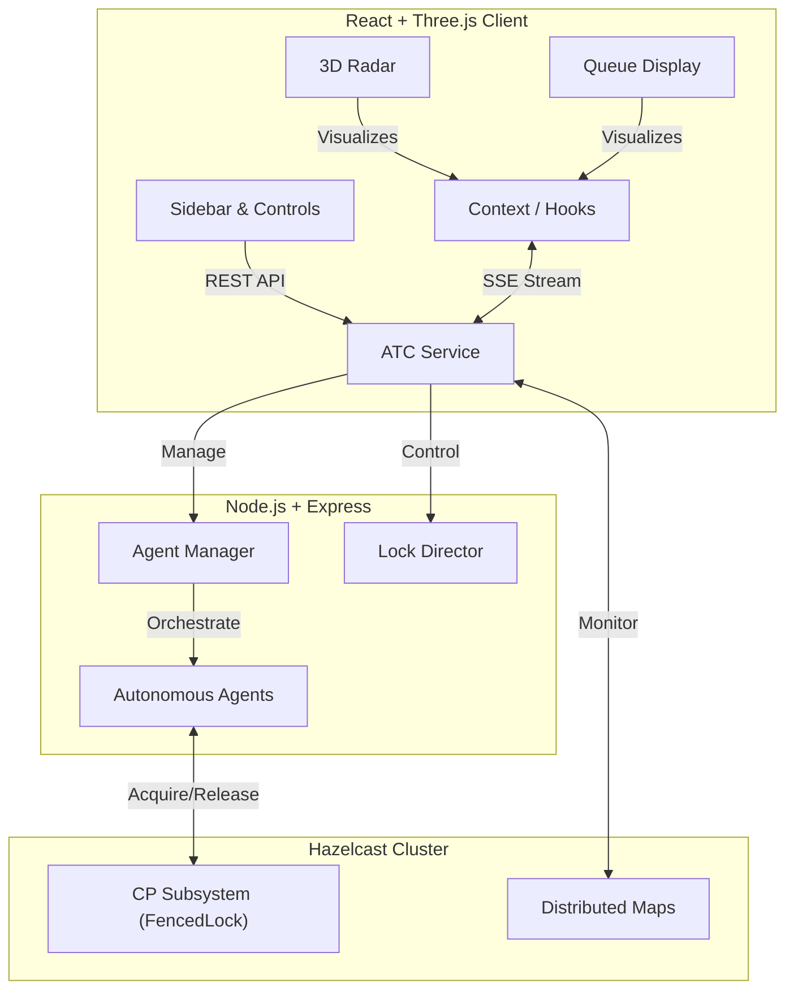

# Agent Traffic Control (ATC) System


**Agent Traffic Control (ATC)** is a high-performance, distributed visualization system designed to monitor and manage autonomous agent resource contention in real-time. Built with a **Cyberpunk-inspired UI**, it provides "God-mode" controls to oversee locking mechanisms, priority queues, and emergency overrides across a distributed Hazelcast cluster.

---

## 🚀 Key Features

### 1. 3D Tactical Radar (Three.js)
- **Real-time Visualization**: Agents are rendered as autonomous drones orbiting a central resource hub.
- **Visual Feedback**:
    - **Green Beam**: Active Lock Holder (Processing).
    - **Purple Pulse**: Force Seize / Hostile Takeover in progress.
    - **Red Pulse**: Paused / Suspended agents.
- **Interactive Control**: Click any drone to inspect status, grant VIP access, or terminate.

### 2. Distributed Locking & Concurrency
- **Hazelcast CP Subsystem**: Guarantees strong consistency for distributed locks (FencedLock).
- **Priority Queueing**: Dynamic scheduling where VIP agents (Star badge) bypass standard waiting lists.
- **Force Transfer (Seize)**: Administrative capability to forcibly rip the lock from the current holder and assign it to a target candidate.

### 3. Live System Monitoring
- **Sector Queue Panel**: Draggable HUD showing the live state of the "Priority Stack" vs "Standard Queue".
- **Terminal Logs**: Real-time event streaming via SSE (Server-Sent Events) with "Tech" and "Standard" view modes.
- **Audio Engine**: Custom `MasterGain` architecture with strict user-interaction policies (no ghost sounds).

### 4. Administrative "God-Mode"
- **Emergency Override**: Instantly suspends all autonomous agents and grants the lock to the "Human-Operator".
- **Global Stop**: One-click system freeze for immediate debugging or safety.
- **Traffic Intensity**: Dynamic scaling of agent pool size (0-10) via slider controls.

---

## 🎬 Demo Scenarios

### Scenario 1: The Hostile Takeover (Force Seize)
> **Objective**: Forcefully transfer control from a deadlock to a high-priority agent.


1.  **Identify**: Locate the current Lock Holder (Green) in the **Radar** or **Queue Display**.
2.  **Select**: Click a waiting agent (e.g., `Agent-2`) to open the Tactical Menu.
3.  **Execute**: Click the **SEIZE (Purple Zap)** button.
4.  **Observe**:
    - The target agent pulses **Purple** in the Radar.
    - The **Queue Display** shows the target jumping to "Seizing" status.
    - The Terminal Log reports: `📡 [CMD] SEIZE TARGET -> Agent-2`.
    - Within seconds, `Agent-2` captures the lock.

### Scenario 2: VIP Fast-Track (Priority Queueing)
> **Objective**: Grant VIP status to an agent to bypass the standard waitlist.


1.  **Monitor**: Observe the "Standard Queue" in the **Queue Display**.
2.  **Grant**: Click the **Star (VIP)** icon on an agent at the bottom of the list.
3.  **Result**:
    - The agent immediately moves to the **"Priority Stack"** section.
    - It bypasses all standard agents for the next lock acquisition cycle.
    - Visual confirmation: Yellow Star badge appears on the drone and in the sidebar.

### Scenario 3: Emergency Protocol (System Override)
> **Objective**: Immediate manual intervention during a simulated failure.


1.  **Trigger**: Click the **Emergency Override** button in the Sidebar Control Panel.
2.  **Effect**:
    - **Audio**: System-wide alert sound plays.
    - **State**: All agents are forced into "Waiting" or "Paused".
    - **Lock**: The `Human-Operator` acquires the lock indefinitely.
    - **Logs**: `🚨 !!! ADMIN_OVERRIDE_ACTIVE !!!` appears in Critical Red.

> **Technical Note on Distributed Consistency**: 
> In this demo, you may observe logs of an agent acquiring the lock *after* the Override command. This is expected behavior in a distributed system (CAP Theorem). The `Human Override` command updates the central Policy Manager instantly, but agents in the middle of an atomic `FencedLock.tryLock()` operation must complete their transaction cycle to maintain data integrity before the new policy takes effect in the next tick. This demonstrates the system's commitment to **Strong Consistency** over immediate eventual availability.


---

## 🏗️ Architecture



> **Note**: This system ensures **strong consistency** of distributed locks through the **Hazelcast CP Subsystem** running in a Dockerized environment.

---

## 📦 Installation & Setup

### Prerequisites
- Docker & Docker Compose
- Node.js v18+ (for local development)
- pnpm (recommended)

### 🚀 Quick Start (Recommended)
The fastest way to launch the backend infrastructure (API + Hazelcast Cluster) is via Docker Compose.

```bash
# 1. Clone the repository
git clone [https://github.com/209512/atc.git](https://github.com/209512/atc.git)
cd atc

# 2. Start Backend & Hazelcast
docker-compose up --build
```
- **Backend API**: http://localhost:3000
- **Hazelcast Server**: http://localhost:5701 (Cluster: dev)
> **Note**: After starting the backend via Docker, please run the Frontend locally for the best development experience (see below).

---

### 💻 Local Development (Frontend)

Since the backend is running in Docker, you just need to launch the client.

```bash
# In a new terminal
cd packages/frontend
pnpm install
pnpm run dev
```
- **Frontend**: http://localhost:5173

---

## 🛠️ Technical Stack

| Component | Technology | Description |
|-----------|------------|-------------|
| **Frontend** | React 18, Vite | Component-based UI architecture |
| **Visualization** | Three.js, R3F | High-performance 3D rendering |
| **Styling** | TailwindCSS | Utility-first responsive design |
| **Backend** | Node.js, Express | Event-driven REST API |
| **Persistence** | Hazelcast IMDG | In-memory distributed data grid |
| **Streaming** | Server-Sent Events | Unidirectional real-time state updates |

---

## 📝 License

Copyright 2026 **209512**

This project is licensed under the **Apache License 2.0**.  
See the [LICENSE](./LICENSE) file for the full license text.

> Licensed under the Apache License, Version 2.0 (the "License");
> you may not use this file except in compliance with the License.
> You may obtain a copy of the License at
> 
>     http://www.apache.org/licenses/LICENSE-2.0
> 
> Unless required by applicable law or agreed to in writing, software
> distributed under the License is distributed on an "AS IS" BASIS,
> WITHOUT WARRANTIES OR CONDITIONS OF ANY KIND, either express or implied.
> See the License for the specific language governing permissions and
> limitations under the License.