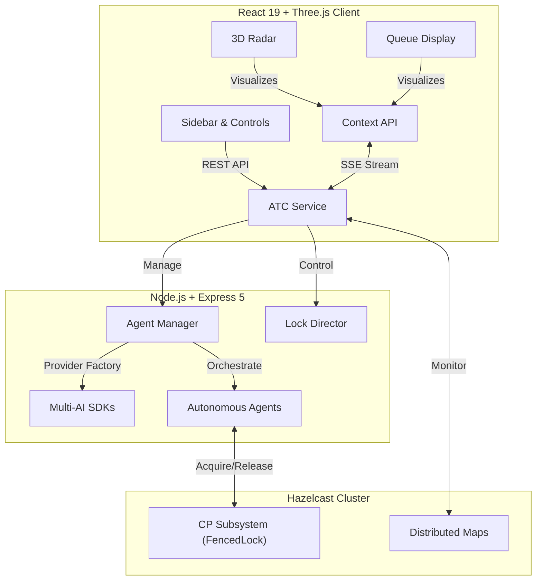

# 🛰️ Agent Traffic Control (ATC) System


**Agent Traffic Control (ATC)** is a high-performance, distributed visualization system designed to monitor and manage autonomous agent resource contention in real-time. Built with a **Cyberpunk-inspired UI**, it provides "God-mode" controls to oversee locking mechanisms, priority queues, and emergency overrides across a distributed Hazelcast cluster.

---

## 🚀 Key Features

### 1. 3D Tactical Radar (Three.js / R3F)
* **Real-time Visualization**: Agents are rendered as autonomous drones orbiting a central resource hub.
* **Smart Camera System**: Auto-tracking with smooth interpolation (`lerp`) and seamless user interruption handling (`OrbitControls` sync).
* **Visual Feedback**:
    * **Green Beam**: Active Lock Holder (Processing).
    * **Purple Pulse**: Force Seize / Hostile Takeover in progress.
    * **Red Pulse**: Paused / Suspended agents.

### 2. Distributed Locking & AI Integration
* **Hazelcast CP Subsystem**: Guarantees strong consistency for distributed locks using the `FencedLock` mechanism.
* **AI Provider Factory**: Abstracted architecture supporting **OpenAI, Google Gemini, and Anthropic Claude** for agent intelligence.
* **Priority Queueing**: Dynamic scheduling where VIP agents (Star badge) bypass standard waiting lists.
* **Force Transfer (Seize)**: Administrative capability to forcibly rip the lock from the current holder.

### 3. Live System Monitoring & Audio
* **Sector Queue Panel**: Draggable HUD showing the live state of the **"Priority Stack"** vs **"Standard Queue"**.
* **Terminal Logs**: Real-time event streaming via **SSE (Server-Sent Events)** with **Virtual Scrolling** for high-performance rendering.
* **Audio Engine**: Custom `MasterGain` architecture providing immersive tactical sound feedback.

---

## 🎬 Demo Scenarios

### Scenario 1: The Hostile Takeover (Force Seize)
> **Objective**: Forcefully transfer control from a deadlock or an underperforming agent to a target candidate.

1. **Identify**: Locate the current Lock Holder (Green) in the **Radar** or **Queue Display**.
2. **Select**: Click any waiting agent (e.g., `Agent-2`) to open the Tactical Menu.
3. **Execute**: Click the **SEIZE (Purple Zap)** button.
4. **Observe**: The target agent pulses **Purple** and captures the lock, while logs report: `[SYS ] [Agent-2] FORCE_TRANSFER_INITIATED`.


---

### Scenario 2: VIP Fast-Track (Priority Injection)
> **Objective**: Grant VIP status to an agent to bypass the standard rotation.

1. **Grant**: Click the **Star (VIP)** icon on an agent in the **Standard Sector**.
2. **Result**: The agent immediately jumps to the **"Priority Stack"** for the next available lock cycle.


---

### Scenario 3: Autonomous Tracking (Tactical Focus)
> **Objective**: Track a specific agent in the 3D space and seamlessly switch to manual control.

1. **Target**: Click any drone in the **Radar** view.
2. **Track**: The camera smoothly zooms in and follows the moving drone.
3. **Interrupt**: Drag the screen to manually control the view; the system instantly returns control to the operator.


---

## 🏗️ Architecture



---

## 📦 Installation & Setup

### Prerequisites

* **Docker & Docker Compose**
* **Node.js v18+** & **pnpm (v10+)**

### 🚀 Quick Start (Docker Mode)

Launch the **Hazelcast infrastructure** and **ATC Backend** simultaneously using Docker.

1. **Run Backend & Infrastructure**
```bash
# Clone the repository
git clone https://github.com/209512/atc.git
cd atc

# Build and start Hazelcast & Backend
docker compose up --build

```

2. **Run Frontend (Local)**
Open a new terminal and launch the frontend development server.
```bash
cd packages/frontend
pnpm install
pnpm dev

```

* **Frontend**: http://localhost:5173
* **Backend API**: http://localhost:3000
* **Hazelcast Server**: `localhost:5701` (Cluster: dev)

---

## 🛠️ Technical Stack

| Component | Technology | Description |
| --- | --- | --- |
| **Frontend** | React 19, Vite 7 | Modern UI & high-speed bundling |
| **Visualization** | Three.js, R3F, Drei | Tactical 3D drone radar |
| **Styling** | TailwindCSS | Utility-first cyberpunk aesthetics |
| **Backend** | Node.js, Express 5 | Event-driven architecture |
| **Distributed** | Hazelcast IMDG & CP | Memory-first consistency & data grid |
| **AI Integration** | OpenAI, Gemini, Claude | Multi-model agent intelligence |

---

## 📝 License

Copyright 2026 **209512** Licensed under the **Apache License, Version 2.0**. See the [LICENSE](./LICENSE) file for details.

> **Technical Note on Consistency**: This system prioritizes **Safety and Consistency** over Availability during network partitions by utilizing the Hazelcast CP Subsystem. All locking operations utilize `FencedLock` to ensure strict distributed consistency.
